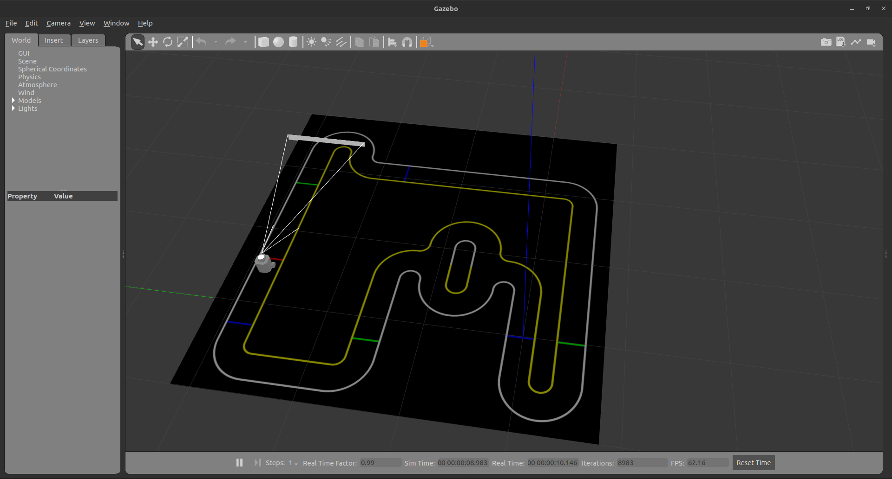
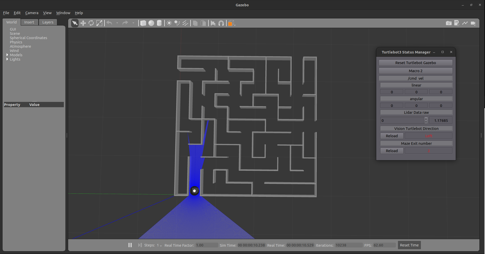

# turtlebot3_simulations_internship

## Installation

1. Install the dependencies
```bash
$ sudo apt-get install -y ros-humble-gazebo-*
```

2. Clone the repository
```bash
$ cd ~/{Your ROS 2 Workspace}/src
$ git clone https://github.com/Team-ROBIT/turtlebot3_simulations_internship.git
$ cd turtlebot3_simulations_internship
$ git submodule update --init --recursive # Not necessary if you already have the submodules
```

3. Build the workspace
```bash
$ cd ~/{Your ROS 2 Workspace}
$ colcon build --symlink-install
$ source install/setup.bash
```

4. Setup the environment variables
```bash
$ gedit ~/.bashrc

# Add the following line
export TURTLEBOT3_MODEL=burger # Turtlebot3 model
export ROS_DOMAIN_ID=${Your ROS 2 domain ID} # ROS 2 domain ID. Make sure not to use the same domain ID as the other person. 

source /usr/share/gazebo/setup.sh # Gazebo setup

alias killg='killall -9 gzserver && killall -9 gzclient && killall -9 rosmaster' # Kill Gazebo, Gazebo client and Ros master
```

## Vision Turtlebot3 Launch
```bash
$ ros2 launch turtlebot3_gazebo internship_vision_turtlebot3.launch.py
```
    

## Maze Turtlebot3 Launch
```bash
$ ros2 launch turtlebot3_gazebo internship_maze_turtlebot3.launch.py
```
    